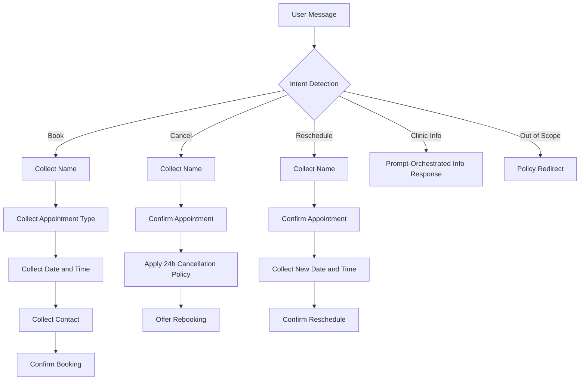
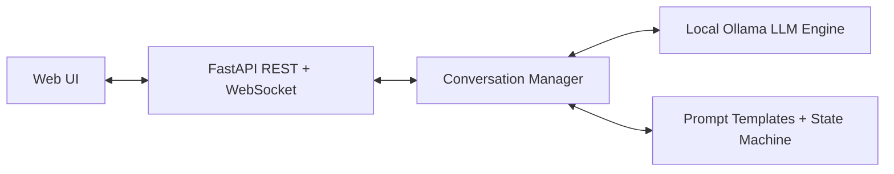

# SmileCare Conversational AI System

A fully local conversational AI system for a dental clinic appointment assistant. The system runs on CPU with a small Ollama-hosted model, exposes REST and WebSocket APIs through FastAPI, uses prompt orchestration plus explicit conversation state, and provides a browser-based chat interface.

## 1. Business Case Selection

### Use-case description
This project implements **Dana**, a scheduling assistant for **SmileCare Dental Clinic**. Dana supports:
- Appointment booking
- Appointment cancellation
- Appointment rescheduling
- Clinic hours and services inquiries
- Out-of-scope redirection back to supported dental tasks

### Conversational tone and policy
Dana is concise, professional, and limited to the dental clinic domain. The system does not use tools, agents, plugins, or RAG. It does not provide medical advice or diagnoses.

### Example dialogues
#### Booking example
- User: `I want to book an appointment`
- Dana: `I'd be glad to help with that. May I have your full name, please?`
- User: `Maria Gonzalez`
- Dana: `Thanks, Maria. What type of appointment do you need...`
- User: `routine check-up`
- Dana: `What date and time would you prefer?`

#### Out-of-scope example
- User: `Can you recommend a restaurant nearby?`
- Dana: `I can only assist with dental appointment scheduling, rescheduling, cancellations, and clinic information.`

### Conversation flow design


## 2. System Architecture Overview



### Components
- `frontend/index.html`: ChatGPT-style web interface with streaming updates, browser-side conversation history, and reset/new-session controls.
- `main.py`: FastAPI server exposing REST and `/ws/chat` WebSocket endpoints.
- `conversation_manager.py`: stateless conversation orchestration using client-carried session state.
- `state_machine.py`: intents, conversation states, validation logic, and policy enforcement.
- `llm_engine.py`: local Ollama adapter for CPU-friendly instruction-tuned inference.
- `prompts/`: prompt templates for each business task.

## 3. Phase II: Local LLM Selection and Optimization

### Model selection
Default model: `qwen2.5:1.5b`

Why this model:
- Small enough for CPU-bound local inference on a laptop
- Instruction-tuned for short conversational tasks
- Available through Ollama with quantized local execution

### Context memory management scheme
The backend is **stateless**. Conversation state is carried by the client and sent with every request.

Signal is preserved through:
- Sliding turn window of the last 12 turns
- Structured entities: patient name, appointment type, requested datetime, contact info
- Policy flags: cancellation policy and current task state

This prevents the model from reconstructing workflow state from long raw transcripts alone.

### Inference latency benchmarking
Benchmark script: `benchmark.py`

It measures end-to-end `/chat` latency across a multi-turn scenario using the stateless session payload.

Most recent local run against `http://127.0.0.1:8001`:
- Overall average latency: `0.149s`
- Deterministic scheduling turns: about `0.001s` to `0.003s`
- Most expensive prompt: out-of-scope restaurant query, average `1.181s`, max `2.667s`

Run:
```bash
python benchmark.py
```

Results are written to `benchmark_results.json`.

## 4. Phase III: Conversation Manager and Prompt Orchestration

Implemented in:
- `conversation_manager.py`
- `state_machine.py`
- `system_prompt.py`
- `prompts/*.py`

Delivered features:
- Maintains dialogue history via client-carried session state
- Enforces booking, cancellation, and rescheduling policies
- Handles turn-taking logic with explicit conversation states
- Builds structured system prompts for clinic information responses
- Supports multi-turn reasoning with fidelity to previous context
- Uses no tools or retrieval

### Multi-turn dialogue tests
Run:
```bash
python test_dialogues.py
```

Covered cases:
- Happy-path booking
- Invalid time booking
- Out-of-scope requests
- Stateless REST contract
- WebSocket streaming contract

## 5. Phase IV: Microservice API Implementation

### REST endpoints
- `GET /health`
- `POST /sessions`
- `DELETE /sessions/{session_id}`
- `POST /chat`

### WebSocket endpoint
- `/ws/chat`

### JSON contract
The backend is stateless. Each `/chat` request includes:
- `message`
- `session`

Each response returns:
- `reply`
- `intent`
- `state`
- updated `session`

### Functional requirements coverage
- Asynchronous request handling: yes
- Concurrent user support: yes, because no server-side session store is shared between users
- Streaming output: yes, via WebSocket incremental `delta` events
- Robust error handling: yes, via structured `error` events and deterministic LLM fallback responses

### Deployment deliverables
- Dockerfile: `Dockerfile`
- Deployment compose file: `docker-compose.yml`
- Postman collection: `postman/SmileCare-Conversational-AI.postman_collection.json`

## 6. Phase V: Web-Based Chat Interface

Delivered UI features:
- Real-time messaging
- Streaming responses
- Conversation history
- Reset functionality
- New session functionality
- WebSocket integration
- Responsive UI on desktop and mobile

## 7. Phase VI: Production Readiness and Evaluation

### Latency benchmarking
Run:
```bash
python benchmark.py
```

Latest executed output in `benchmark_results.json`:
- `overall_avg_latency_s`: `0.149`
- `turn_count`: `24`

### Stress testing
Run:
```bash
python stress_test.py
```

This simulates concurrent users sending stateless multi-turn chat requests.

Most recent local stress run against `http://127.0.0.1:8001` with `10` concurrent users:
- Total requests: `60`
- Average latency: `0.01s`
- P95 latency: `0.027s`
- Max latency: `0.037s`

### Failure handling
Implemented safeguards:
- Validation for invalid booking hours and contact details
- WebSocket error events for malformed requests
- LLM fallback behavior when Ollama is unavailable
- Session reset and new-session recovery paths in the UI

## 8. Setup Instructions

### Open the project
Open this folder in VS Code:
`/Users/amnahameed/Downloads/NLP_ASSI_2-main`

### Create and activate a virtual environment
```bash
python3 -m venv .venv
source .venv/bin/activate
pip install -r requirements.txt
```

### Start Ollama
If Ollama is not already running:
```bash
ollama serve
```

Pull the model if needed:
```bash
./scripts/bootstrap_model.sh qwen2.5:1.5b
```

### Run the backend
```bash
python -m uvicorn main:app --reload
```

### Open the web UI
Visit [http://127.0.0.1:8000](http://127.0.0.1:8000)

## 9. Dockerized Deployment

```bash
docker compose up --build
```

Services:
- `app`: FastAPI backend on port `8000`
- `ollama`: local LLM service on port `11434`

## 10. Submission Checklist Mapping

### Required submission artifacts
- Source code repository: present locally
- Dockerfile + deployment scripts: present
- Postman API collection: present
- Web UI frontend: present
- README with setup, architecture, model selection, benchmarks, and limitations: present

## 11. Known Limitations

- Appointment lookup is simulated; there is no external clinic database.
- Booking and cancellation flows are deterministic for policy safety, while clinic-information answers may use the LLM.
- WebSocket streaming is incremental and user-visible, but deterministic workflow replies are streamed in chunks rather than sampled token-by-token from the model.
- Stress and latency results depend on the local machine, CPU load, and Ollama model availability.
